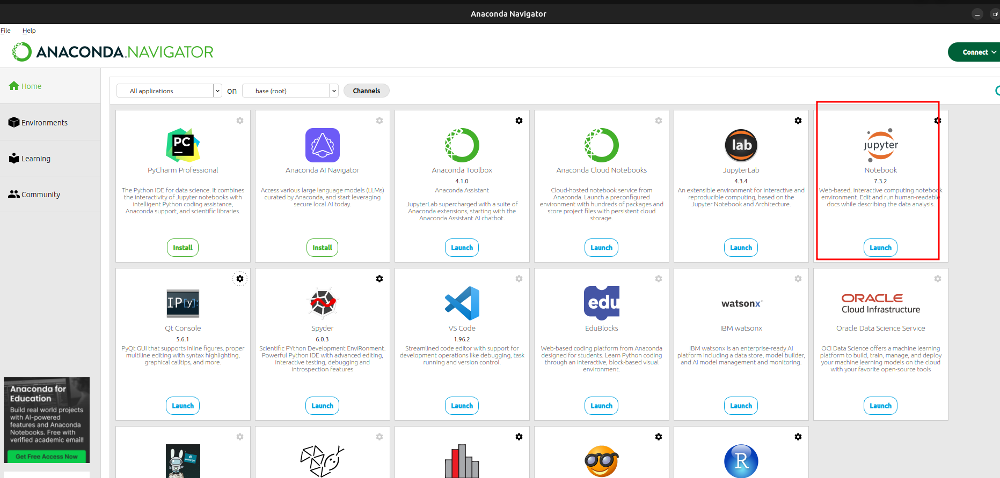

# Jupiter notebook

## Entorno offile

Lanzar Anaconda navigator

Podemos situarnos donde queramos y crear el fichero correspondiente

Podemos ver los entorno virtuales para trabajar

Debemos mirar que la versión de python con la que queremos trabajar

También podemos ver los distintos bloques que podemos crear

* Tipo Markdown
* Tipo codigo para ejecutar python
* Raw -> textp som ejecutar ni renderizar, útil para exportar
	* no se ejecuta por tanto no tiene salida
	* No se renderiza, es decir no se ve visualmente
	* Flujos de trabajo que implica exportaciones complejas

## Entorno outfile